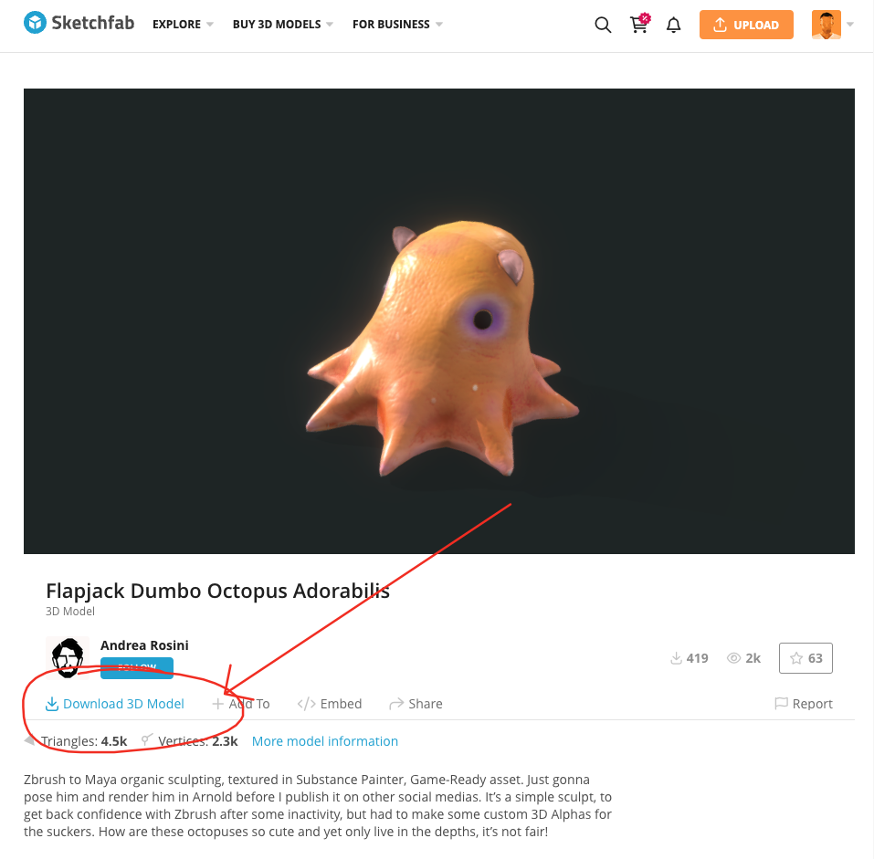
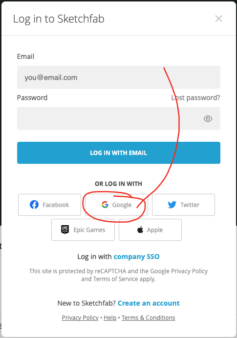

# Flapjack Octopus

## Finding Ready-Made Assets

3D modeling can be a fun but very difficult and slow process. To expedite your workflow, it can be helpful to download ready-made assets created by others. One valuable resource for accessing a vast collection of high-quality 3D models is Sketchfab, an online repository where artists from various industries, including gaming, movies, and architectural visualization, can showcase and share their 3D creations. On Sketchfab, you'll find a diverse range of models spanning characters, creatures, environments, and objects, allowing you to leverage existing assets and focus your efforts on assembling and customizing them to suit your specific needs.

Today, we'll be downloading a free asset from Sketchfab. You'll need to have a free Sketchfab account, lucky for you I've already created a shared one for us.

Visit the following link. We'll be using this model for the demo today.

https://sketchfab.com/3d-models/flapjack-dumbo-octopus-adorabilis-977d38f89ca54c8b91b9667d52cb3d79

You should see a screen that looks like this. Click the `Download 3D Model` button to download the model. 

If prompted with a login page like the one below, select the option to sign in with Google. From here, sign in to the watanabekids12 gmail account. Alternatively, you may use your own account if desired.

