# Flapjack Octopus

This is an educational document outlining how to create a sample exhibit based around a cute octopus.

To start, scan the following qr code, or visit the link below (if viewing on mobile).

https://adobeaero.app.link/UVQHRR1cYHb

This document will explain in detail, for beginners, how to recreate this scene in Adobe Aero. 

Readers will learn how to download 3D models, import them into Adobe Aero, and animate basic behaviors to add interactivity into a scene.

If you're ready to learn, continue reading!

## Finding Ready-Made Assets

3D modeling can be a fun but very difficult and slow process. To expedite your workflow, it can be helpful to download ready-made assets created by others. One valuable resource for accessing a vast collection of high-quality 3D models is Sketchfab, an online repository where artists from various industries, including gaming, movies, and architectural visualization, can showcase and share their 3D creations. On Sketchfab, you'll find a diverse range of models spanning characters, creatures, environments, and objects, allowing you to leverage existing assets and focus your efforts on assembling and customizing them to suit your specific needs.

Today, we'll be downloading a free asset from Sketchfab. You'll need to have a free Sketchfab account, lucky for you I've already created a shared one for us.

Visit the following link. We'll be using this model for the demo today.

https://sketchfab.com/3d-models/flapjack-dumbo-octopus-adorabilis-977d38f89ca54c8b91b9667d52cb3d79

You should see a screen that looks like this. Click the `Download 3D Model` button to download the model. 

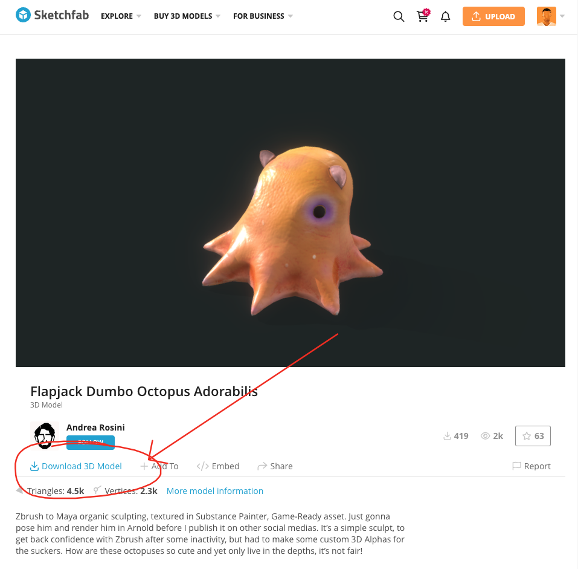

If prompted with a login page like the one below, select the option to sign in with Google. From here, sign in to the watanabekids12 gmail account. Alternatively, you may use your own account if desired.

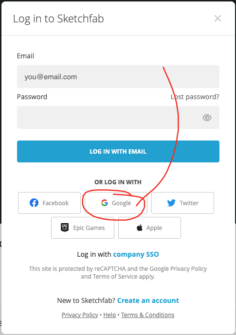

Once signed in, click the download button again and you'll see the following list of download options. 

These are different options for file formats. For 3d models, Adobe Aero accepts FBX and GLB files. We will grab the 1k .glb file circled in red below.

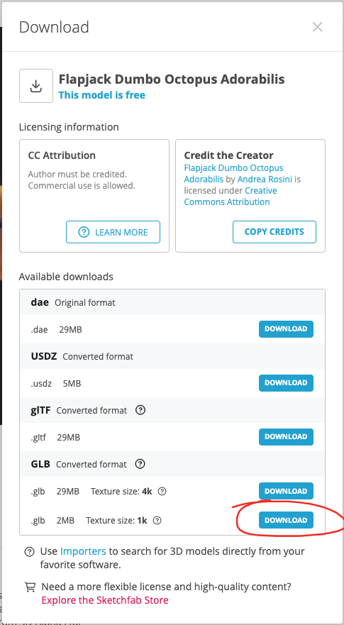

For a higher detailed model, you may select the 4k model, but note that higher detail means larger files. In this case, the 4k model is 29 MB, and your Adobe Aero scenes should be under 50 MB total to prevent long loading times.

Now you've got a copy of the model, we can move on.

## Importing Assets

This section will cover how to bring your assets (like the octopus we just downloaded) into your Adobe Aero scene.

First, create a new Adobe Aero project and click the + button in the sidebar on the left, shown below.

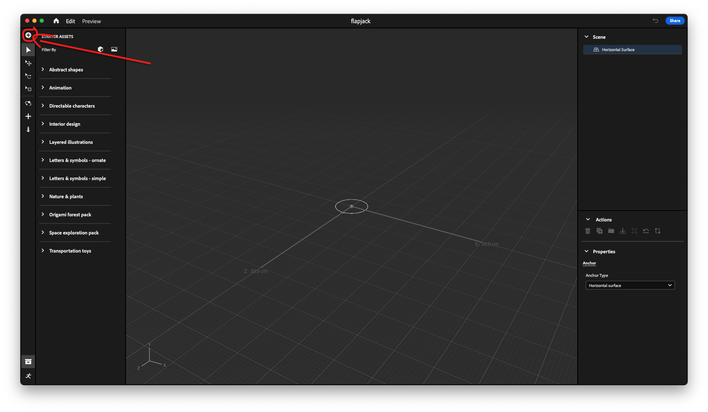

You should see a popup window of your filesystem. Find and click the octopus glb file to add it to the scene.

You should see the octopus load in to your view, it will be too large initially. So we will need to resize it.

To scale the model, drag any of the square handles labeled A inwards.

Alternatively, you can specify the exact dimensions of the model by typing in measurements in centimeters at the point labeled B.

Since there's a lock icon next to Size, we can change one dimension, in this case, X, and the others will scale accordingly to preserve the shape of the model.

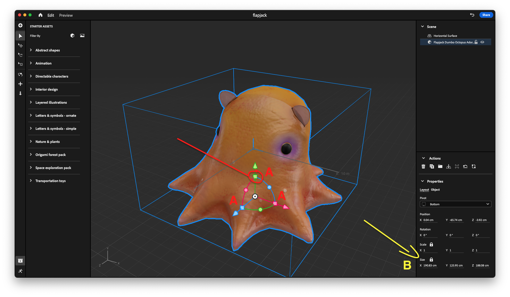

Set the size of the octopus to be 8cm across in the X dimension.

It should resemble the following screen. Be sure to use your mousewheel to zoom in and out so you can see the model.

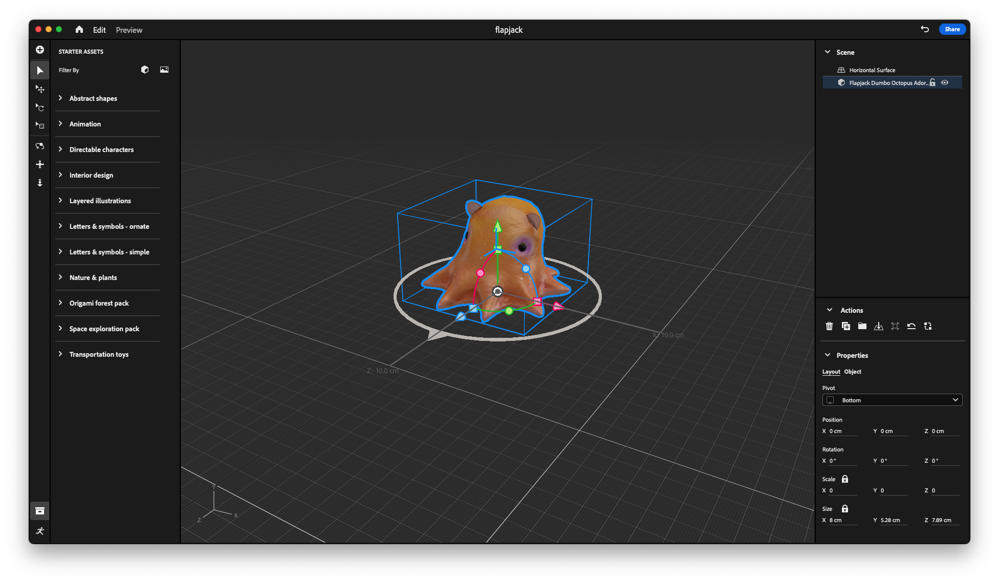

Congrats! You've successfully imported a model into Adobe Aero. Now, before we add behaviors, let's preview our octopus and make sure everything went well.

Click the blue share button in the top right corner, shown below.

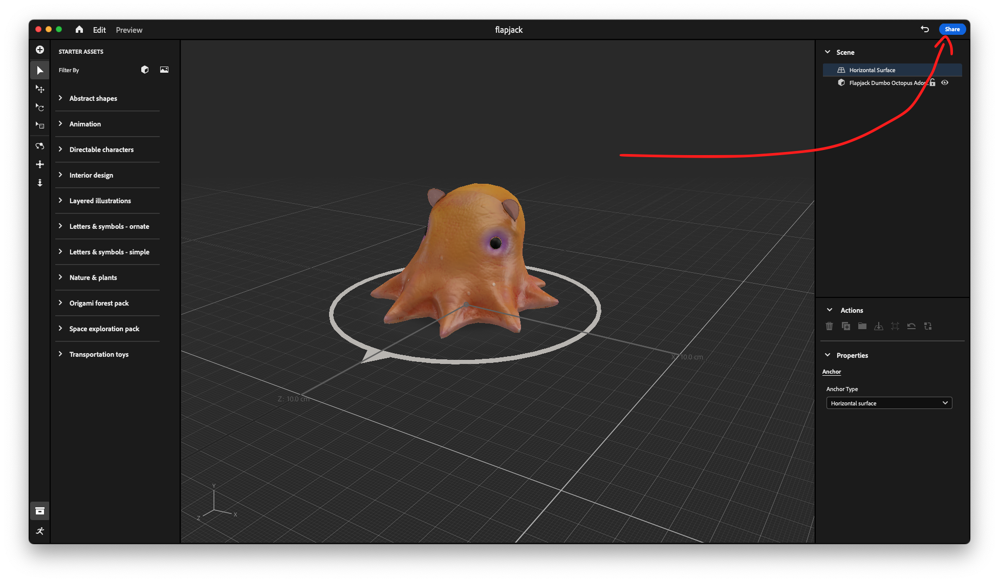

A window will appear like the one below. Click the blue `Create Link` button. 

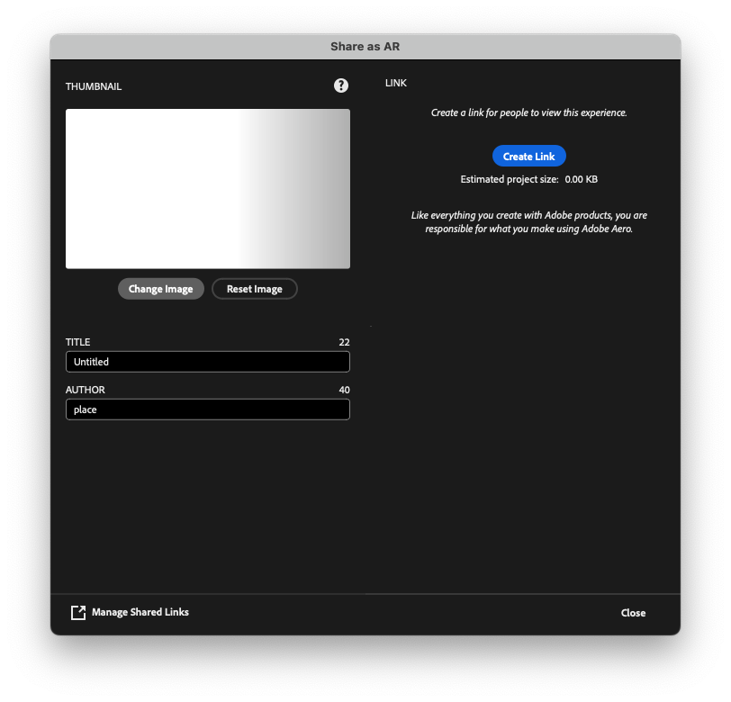

After loading, a QR code should appear. Scan it and follow the on screen instructions. If the octopus looks appropriately sized to fit in the palm of your hand, everything went well.

If it's too large, try checking the size of the octpus was correctly set to 8 cm, or try scanning a different horizontal surface to anchor.

## Defining Behaviors

Behaviors allow us to make simple animations in response to events. They are the basic building blocks of all movement and interactivity in Aero. 

First, open the Behaviors panel by clicking the running person icon in the bottom left.

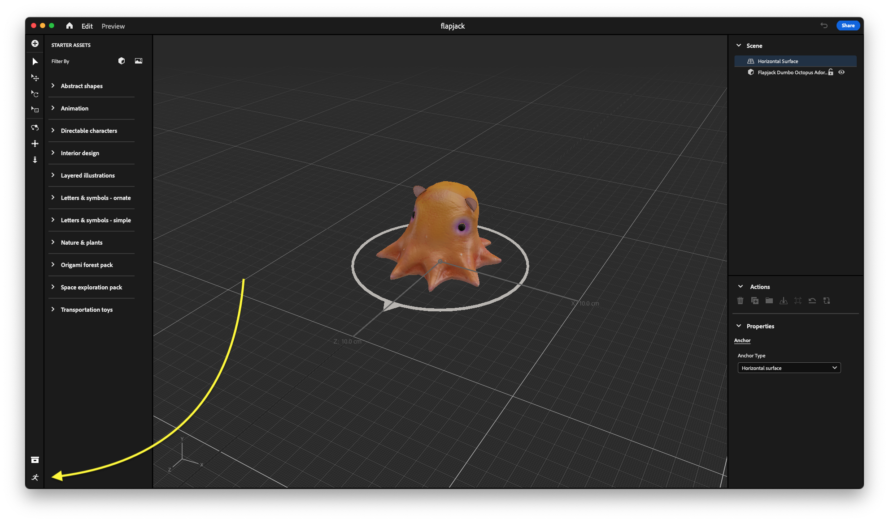

You will see a panel open up, from here you can click the button to add a trigger. Triggers are events which can cause programmed behaviors to start.

The four triggers are `Start`, `Tap`, `Proximity Enter` and `Proximity Exit`. 

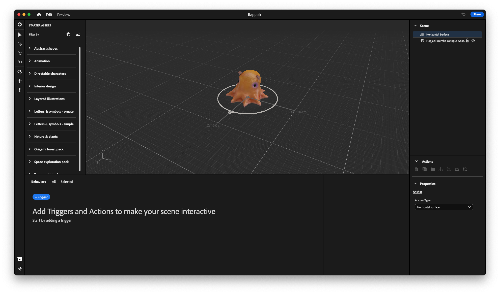

For now, use the `Start` trigger. This is the simplest trigger for use when you want a behavior to trigger automatically when the scene loads in.

You should see the following page, now select an Action to occur when the scene starts. We will make the octopus bounce up and down slowly.

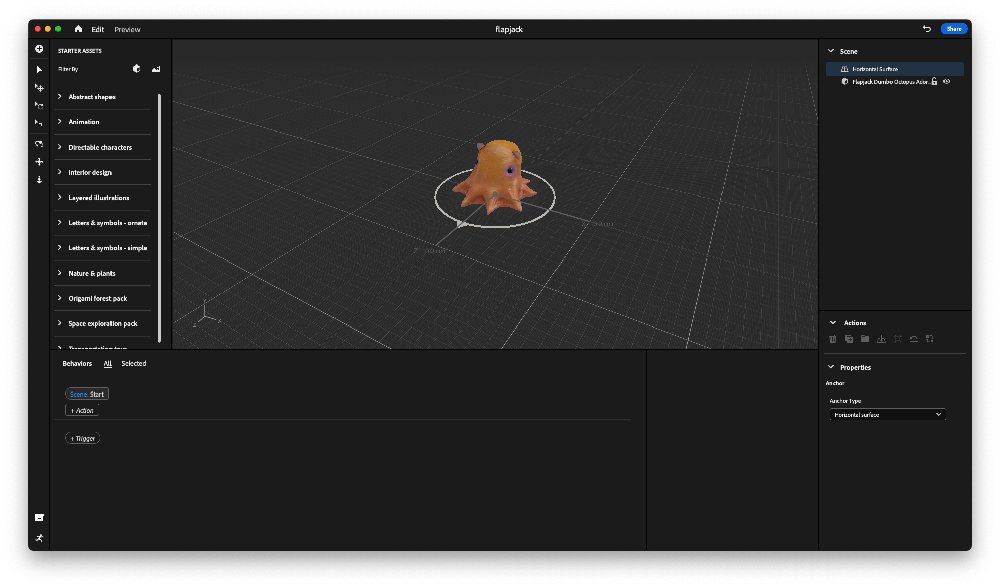

Select Bounce under Actions, then set the following settings.

- Y Offset: 1cm. This is the height the octopus will jump each bounce.
- Easing: Ease in-out. This makes the bounce appear more elastic by moving the octopus faster near the beginning and end of the animation.
- Infinite: The octopus will bounce as long as the scene is active.

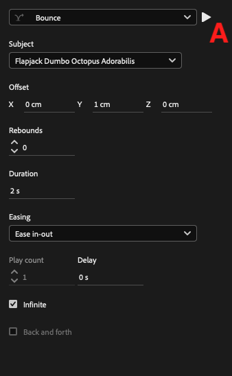

Now, click the triangular play button at the top of the box to trigger a single play of the Bounce animation. The button is labeled A in the figure above.

Alternatively, click the preview to view the continual bouncing. The preview window is great for testing your experience without needing to scan the qr code and load the scene on your phone, saving you time.

## Adding the popout card

<!-- TODO: Add url -->
First, download the premade card here. 

Import it into the scene just like the Octopus model before.

Then, using what you know about scaling, shrink the card and move it around until it's small and hiding inside the octopus.

### Programming the popout

Add a new trigger by tapping the `+Trigger` button in the behavior panel.

Then select `Tap` and set the subject to the octopus.

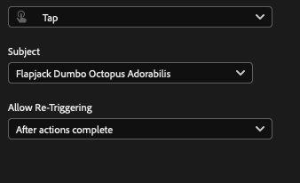

Click on the `+Action` button and select `Scale`.

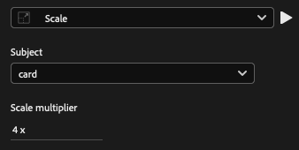

Set the scale multiplier to roughly 4x, or whatever size you think is good for the card. 

Feel free to test that action. It should grow to become visible, although it will be clipping through the octopus. 

To move it, add a second action by clicking the `+Action` button below.

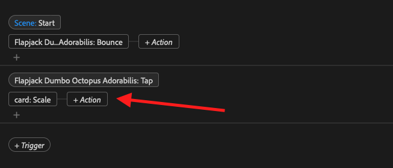

Add a move action and set the following settings. Ensure that the subject is the card, since this is the object we wish to move.

Shift it wherever you like it.

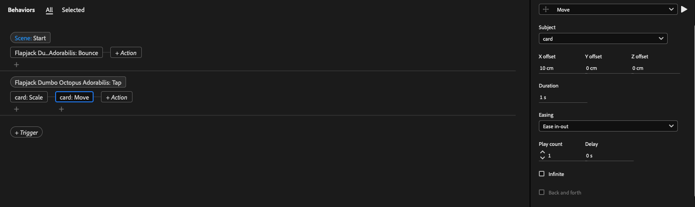

Now preview the animation by going back to the preview tab and clicking the octopus.

Whoops! Looks like the card first scales, then moves, resulting in a short period of time where the card displays strangely on top of the octopus, like seen below.

We can fix this by running the two animations in parallel, so the card scales and moves at the same time.

To do this, simply drag the Move action to below the Scale action, like shown below.

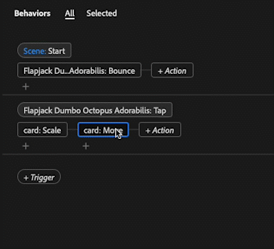

Now, preview the animation again to see the fix. Now, the card appears to pop out from within the octopus, like below.

### Programming the reverse

Now, we just need to enable the user to hide the card.

We will just implement the reverse action on another Tap action.

Add a new Tap trigger with the card as the subject. 
Underneath, add a `Scale` action and set the scale factor to 0.25x.
Finally, add a `Move` action and set the X offset to -10cm.

If you've done it correctly, it should work like the following.

## Wrapping Up

Congratulations! You learned how to download assets from SketchFab, importing them into Adobe Aero, and basic behavior scripting.

Now all that's left is to view your work in AR, so click that Share button one more time, make sure to give your work an interesting title, and sign your name. Then, click `Apply Changes` to update the qr code.